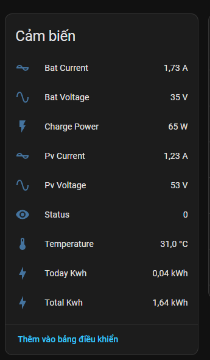

# Tích hợp MPPT MQ — Sạc Solar MPPT Mạnh Quân cho Home Assistant


**Cài đặt qua HACS (bằng đường dẫn GitHub)**
1. Thêm repository này vào HACS như một custom repository (Category: Integrations).
2. Cài đặt mục `MPPT MQ (Mạnh Quân SmartSolar)` từ HACS.
3. Khởi động lại Home Assistant.
4. Vào Settings → Devices & Services → Add Integration → tìm và chọn `MPPT MQ (Mạnh Quân SmartSolar)`, nhập cấu hình MQTT cloud.

**Các trường cấu hình (UI và YAML)**
- `host`: tên host hoặc IP của MQTT cloud (ví dụ: `mqttx.smartsolar.io.vn`).
- `port`: cổng WebSocket (mặc định `8084`).
- `device_id`: ID thiết bị (dùng làm tiền tố entity id).
- `type`: Loại thiết bị mặc định `45a`.
- `device_name`: tên hiển thị của thiết bị (mặc định `MPPT`).
- `reset_timeout`: thời gian (giây) không nhận dữ liệu thì đánh dấu offline (mặc định `30`).

Ví dụ YAML (tùy chọn, sẽ được import vào một config entry):
```yaml
mppt_mq:
  host: mqttx.smartsolar.io.vn
  port: 8084
  type: 45a
  device_id: xxxxxxxx
  device_name: MPPT
  reset_timeout: 30
```

**Entity được tạo**
- Mỗi mục trong `dataStreams` sẽ được tạo thành một entity dạng `sensor` bằng cách gọi `hass.states.async_set`.
- Tên entity: `sensor.<device_id>_<stream_name>` ví dụ `sensor.xxxxxxxx_pv_voltage`.
- Entity trạng thái availability: `sensor.<device_id>_availability` (giá trị `online` / `offline`).

**Lưu ý quan trọng**
- Yêu cầu Python package: `paho-mqtt` (được khai báo trong `manifest.json`).

**Khắc phục sự cố (gợi ý)**
- Nếu không nhận dữ liệu: kiểm tra `host`, `port` và `type` đúng.
- Kiểm tra log của Home Assistant (log level của integration: `mppt_mq`) để thấy lỗi kết nối hoặc parsing.

**Đóng góp**
- Mở issue hoặc pull request trên repo GitHub nếu bạn muốn bổ sung tính năng hoặc báo lỗi.

---
File chính của integration nằm trong `custom_components/mppt_mq/`.
